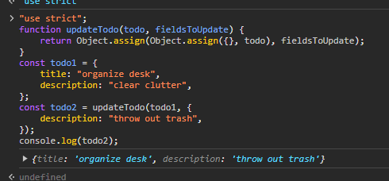

# Awaited\<Type\>

# Partial\<Type\>

- Constructs a type with all properties of Type set to optional. This utility will return a type that represents all subsets of a given type.

```ts
interface Todo {
  title: string;
  description: string;
}

function updateTodo(todo: Todo, fieldsToUpdate: Partial<Todo>) {
  return { ...todo, ...fieldsToUpdate };
}

const todo1 = {
  title: "organize desk",
  description: "clear clutter",
};

const todo2 = updateTodo(todo1, {
  description: "throw out trash",
});
```



- The `Partial` utility is useful when you want to update an object with new properties. In the example above, the `updateTodo` function takes a `todo` object and a `fieldsToUpdate` object. The `fieldsToUpdate` object is of type `Partial<Todo>`, which means that all properties of `Todo` are optional. This allows you to update only the properties you want without having to provide all the properties of the `Todo` object.
