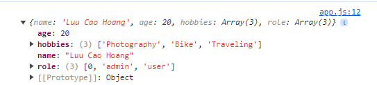

# Core Types

In TypeScript, you work with types like string or number all the times.

> Important: It is string and number (etc.), NOT String, Number etc.
> The core primitive types in TypeScript are all lowercase!

## number

- All number, no difference between integers or floats

```
1, 5.3, -10
```

## string

- All text values

```
"Hi", 'Hi', `Hi`
```

## boolean

- Just these two, no "truthy" or "falsy" values

```
true, false
```

## object

- Any JavaScript object, more specific types (type of object) are possible

```ts
const person = {
  name: "Luu Cao Hoang",
  age: 20,
};

// const person: {
//   name: string;
//   age: number;
//}

//any object come with object type

const person: object = {
  name: "Luu Cao Hoang",
  age: 20,
};

// const person: object

console.log(person.name);
// error: Property 'name' does not exist on type 'object'.
// because we specify for typescript that person is an object (original object type)

//if we want to specify the clearly type of the object, we can do like below
const person: {
  //key: type
  name: string;
  age: number;
} = {
  name: "Luu Cao Hoang",
  age: 20,
};

console.log(person.name); //no error
```

### nested object

Let's say you have this JavaScript object:

```ts
const product = {
  id: 'abc1',
  price: 12.99,
  tags: ['great-offer', 'hot-and-new'],
  details: {
    title: 'Red Carpet',
    description: 'A great carpet - almost brand-new!'
  }
}
This would be the type of such an object:

{
  id: string;
  price: number;
  tags: string[];
  details: {
    title: string;
    description: string;
  }
}
```

So you have an object type in an object type so to say.

## Array

- Any JavaScript array, type can be flexible or strict (regarding the element types)
  > [1,2,3] > ["Hello", "World"]

```ts
const person = {
  name: "Luu Cao Hoang",
  age: 20,
  hobbies: ["Photography", "Bike", "Traveling"],
};

// (property) hobbies: string[]

let favoriteActivities: string[];
favoriteActivities = ["Sports"];
favoriteActivities = "Sport"; //error: Type 'string' is not assignable to type 'string[]'.
favoriteActivities = ["Sports", 19]; //error: Type 'number' is not assignable to type 'string'.

let favoriteActivities: any[];
// flexible array
// you can put any type of element in the array
```

- Iterating through an array

```ts
const person = {
  name: "Luu Cao Hoang",
  age: 20,
  hobbies: ["Photography", "Bike", "Traveling"],
};

for (const hobby of person.hobbies) {
  console.log(hobby.toUpperCase());
  //can use any string method because typescript know that hobby is a string
}
```


# Tuple

- Fixed-length array
- Fixed type in each position

```ts
const person = {
  name: "Luu Cao Hoang",
  age: 20,
  hobbies: ["Photography", "Bike", "Traveling"],

  role: [2, "author"], //tuple
  //(property) role: (number | string)[]
};

person.role.push("admin");
person.role[1] = 10;
//no error, role become: [2, "author", "admin", 10]

person.role[1] = 10; //error: Type 'number' is not assignable to type 'string'.
```


> Caution: when you do not specify clearly the type of the tuple with the declaration, TypeScript will infer the type of the tuple as an array of union type.

```ts
const person = {
  name: "Luu Cao Hoang",
  age: 20,
  hobbies: ["Photography", "Bike", "Traveling"],
  role: [2, "author"],
};

person.role = [0, "admin", "user"]; //this work!!!!!
```



- Compare to this:

```ts
const person = {
  name: string;
  age: number;
  hobbies: string[];
  role: [number, string]; //tuple
} = {
  name: "Luu Cao Hoang",
  age: 20,
  hobbies: ["Photography", "Bike", "Traveling"],
  role: [2, "author"],
};

person.role = [0, "admin", "user"]; //error !!!!!
```

> error because we specify exactly the type of the tuple: [number, string]

# Enum

> The name of enum must be in PascalCase

- Enum is a way of giving more friendly names to sets of numeric values.
- Automatically enumerated (liệt kê) global constant identifiers.

```ts
enum Role {
  ADMIN, //0
  READ_ONLY, //1
  AUTHOR, //2
}
```

- No specify: increment from 0
- Specify: increment from the specified number
- You can also assign your own values to the enum keys:

```ts
enum Role {
  ADMIN = 7,
  READ_ONLY,
  AUTHOR,
}
// ADMIN = 7, READ_ONLY = 8, AUTHOR = 9

enum Role {
  ADMIN = 7,
  READ_ONLY = 100,
  AUTHOR = 200,
}
// ADMIN = 7, READ_ONLY = 100, AUTHOR = 200

enum Role {
  ADMIN = "ADMIN",
  READ_ONLY = 100,
  AUTHOR = 200,
}
// ADMIN = ADMIN, READ_ONLY = 100, AUTHOR = 200

enum Role {
  ADMIN = "ADMIN",
  READ_ONLY = 100,
  AUTHOR,
}
// ADMIN = ADMIN, READ_ONLY = 100, AUTHOR = 101
```

## Any

- Any kind of value, no specific type assignment

```ts
let favoriteActivities: any;
let favoriteActivities: any[]; //flexible array
```

# Union

- Look back to the sum function, if i want to make it more flexible, rename it to combine which i can do concatenate for string or addition for a number , i can use union type
- Typescript will complain if you try to use a method that is not available on all types in the union, for this case is if two input are string, not use + operator directly
- We need to check it at runtime
  
  > You do not always check the type at runtime, its base on your requirement: "does each datatype handle a slightly different way?"

```ts
function combine(input1: number | string, input2: number | string) {
  let result;
  if (typeof input1 === "number" && typeof input2 === "number") {
    result = input1 + input2;
  } else {
    result = input1.toString() + input2.toString();
  }
  return result;
}

console.log(combine(8, 8)); // 16

console.log(combine("Hoang", "Cao")); // HoangCao
```

# Literal

- Specific value

```ts
function combine(
  input1: number | string,
  input2: number | string,
  resultConversion: string
) {
  let result;
  if (typeof input1 === "number" && typeof input2 === "number") {
    result = input1 + input2;
  } else {
    result = input1.toString() + input2.toString();
  }
  if (resultConversion === "as-number") {
    return +result; // convert to number
  } else {
    return result.toString();
  }
}

console.log(combine("30", "26", "as-number"));
//3026
//not which value that i expected
```

- I will modifier the if condition for match my requirement
  > if (typeof input1 === "number" && typeof input2 === "number") || resultConversion === "as-number"

```ts
console.log(combine("30", "26", "as-number")); //56
```

- The resultConversion variable only store input values: `"as-number"` or `"as-text"`
  - I can you enum
  - I can use literal type of course

```ts
function combine(
  input1: number | string,
  input2: number | string,
  resultConversion: "as-number" | "as-text"
);
```

# Type Alias

```ts
type Combinable = number | string;
type ConversionDescriptor = "as-number" | "as-text";

function combine(
  input1: Combinable,
  input2: Combinable,
  resultConversion: ConversionDescriptor
);
```

# Type Assignment && Type Inference

> variable_name: type

```ts
let a = 1;
const b = "Hi";
const sum = (a: number, b: number) => a + b;
```

- TypeScript will automatically infer the type of the variable based on the value assigned to it.
- It means: if you assign a number to a variable, TypeScript will infer the type of that variable as a number.

```ts
const a = 1; //hover and receive const a: 5

let a = 1; //hover and receive let a: number
let a: number = 1; //same as above but may redundant

let c;
c = 1; //hover and receive let c: any

let d: number;
d = "hello"; // error: Type '"hello"' is not assignable to type 'number'.

let result = sum(1, 2); //hover and receive const result: number
result = "hello"; // error: Type '"hello"' is not assignable to type 'number'.
```
