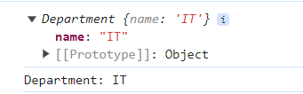

# Class

- A class is a blueprint for creating objects with specific properties and methods already attached to it.

```ts
class Department {
  name: string;

  constructor(name: string) {
    this.name = name;
  }

  describe() {
    console.log("Department: " + this.name);
  }
}

console.log(new Department("IT"));
console.log(new Department("IT").describe());
```



## this

```ts
const accounting = new Department("Accounting");
accounting.describe();

const accountingCopy = { describe: accounting.describe };
accountingCopy.describe(); //undefined
// just a dummy object, not base on any class
```

```ts
class Department {
  name: string;

  constructor(name: string) {
    this.name = name;
  }

  describe(this: Department) {
    console.log("Department: " + this.name);
  }
}
```

- `this: Department` is a type of `this` keyword, it means that `this` keyword must be an instance of `Department` class.
- Make below code error, because the accountingCopy object is not an instance of `Department` class.

```ts
const accountingCopy = { describe: accounting.describe };
accountingCopy.describe(); //undefined
// just a dummy object, not base on any class
```

```ts
const accountingCopy2 = { name: "DUMMY", describe: accounting.describe };
accountingCopy2.describe(); //Department: DUMMY
```

> ts see: OK,hmm the object have the name property, so it's OK

```ts
const accountingCopy3 = { describe: accounting.describe.bind(accounting) };
accountingCopy3.describe(); //Department: Accounting
```
