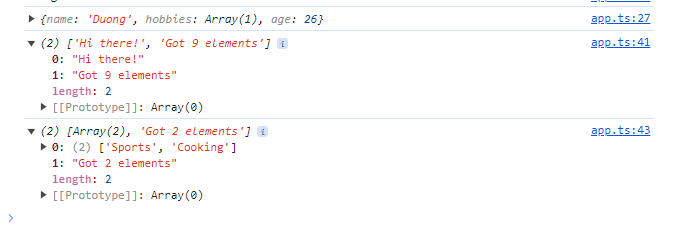

# Generics

Generics are a way to make components more flexible and reusable. Just as functions can take arguments of any type, so can classes and interfaces. This allows you to create components that are more flexible and reusable.

- If i know already the type of elements in the array, i can do stuff with the string

```ts
const names = ["Max", "Manuel"]; // string[]

const names: Array<string> = ["Hoang", "Duong"];

const names: Array<string | number> = ["Hoang", "Duong", 1, 99];

const promise: Promise<string> = new Promise((resolve, reject) => {
  setTimeout(() => {
    resolve("This is done!");
  }, 2000);
});

promise.then((data) => {
  data.split(" ");
});
```

# Create a generic function

```ts
function merge(objA: object, objB: object) {
  return Object.assign(objA, objB);
}
const mergedObj = merge({ name: "Hoang" }, { age: 30 });
mergedObj.name; // Error
```

> Typescript doesn't know the type of the object, so it will return object

```ts
function merge<T, U>(objA: T, objB: U) {
  return Object.assign(objA, objB);
}

const mergedObj = merge({ name: "Hoang" }, { age: 30 });

mergedObj.name; // Hoang
```

> i don't know why the TS keep getting error here, so i need to fix the T and U extended by Object

```ts
function merge<T extends Object, U extends Object>(objA: T, objB: U) {
  return Object.assign(objA, objB);
}

const mergeObj = merge({ name: "Hoang" }, { age: 26 });
console.log(mergeObj.name);
```

```ts
mergeObj = merge<{ name: string; hobbies: string[] }, { age: number }>(
  { name: "Duong", hobbies: ["walking"] },
  { age: 26 }
);

console.log(mergeObj);
```

# Type Constraints

```ts
function merge<T extends object, U extends object>(objA: T, objB: U) {
  return Object.assign(objA, objB);
}

const mergeObj = merge({ name: "Hoang" }, { age: 26 });

console.log(mergeObj.name);
```

# Another Generic Function

```ts
function countAndDescribe<T extends { length: number }>(
  element: T
): [T, string] {
  let descriptionText = "Got no value";
  if (element.length === 1) {
    descriptionText = "Got 1 element";
  } else if (element.length > 1) {
    descriptionText = "Got " + element.length + " elements";
  }
  return [element, descriptionText];
}

console.log(countAndDescribe("Hi there!"));

console.log(countAndDescribe(["Sports", "Cooking"]));
```



# The key of constraints

```ts
function extractAndConvert<T extends object, U extends keyof T>(
  obj: T,
  key: U
) {
  return "Value: " + obj[key];
}

console.log(extractAndConvert({ name: "Hoang" }, "name"));
```

# Generic Classes

```ts
class DataStorage<T extends string | number | boolean> {
  private data: T[] = [];

  addItem(item: T) {
    this.data.push(item);
  }

  removeItem(item: T) {
    this.data.splice(this.data.indexOf(item), 1);
  }

  getItems() {
    return [...this.data];
  }
}
```

```ts
let objStorage = new DataStorage<string>();
objStorage.addItem("Hoang");
objStorage.addItem("Duong");
objStorage.addItem("Nhu");
console.log(objStorage.getItems());
```


# Generic Utility Types

```ts
interface CourseGoal {
  title: string;
  description: string;
  completeUntil: Date;
}

function createCourseGoal(
  title: string,
  description: string,
  date: Date
): CourseGoal {
  return { title: title, description: description, completeUntil: date };
}

// we do not want to do all this in one step

function createCourseGoal(
  title: string,
  description: string,
  date: Date
): CourseGoal {
  let courseGoal: Partial<CourseGoal> = {};
  //the initial can be empty, because we will fill it later
  //partial type let us to create an object with all properties optional
  courseGoal.title = title;
  courseGoal.description = description;
  courseGoal.completeUntil = date;
  return courseGoal as CourseGoal;
}

const names: Readonly<string[]> = ["Hoang", "Duong"];
names.push("Nhu"); // Error
names.pop(); // Error
```

- `Partial`: This utility type allows you to create a new type from an existing type where `all properties are optional`. This is useful when you want to create a new object based on an existing object but you don't want to have to set all the properties.
- `Readonly`: This utility type allows you to create a new type from an existing type where `all properties are readonly`. This is useful when you want to prevent changes to an object after it has been created.
