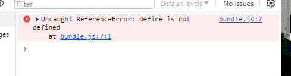
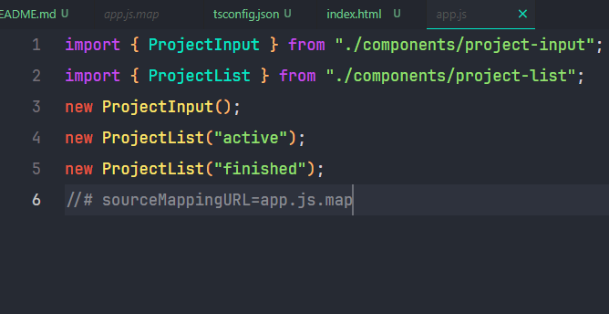
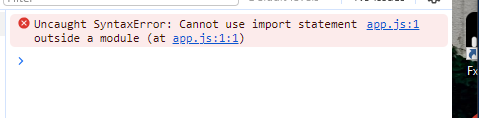

# ES6 Module

- ES6 module is a way to organize code in a separate file.

### The import must be with `.js` extension

- Because at now, we need a browser to run the code, must keep the .js
- But in Angular project, you may not need to

- After organizing the code in a separate file, look at the browser, we can see the error
  
- We should to switch to other "module" at tsconfig.json
  > "module": "es2015"
- Comment out the "outFile"

## So the app.js will contain `import` keyword



## But we still get error

- Uncaught SyntaxError: Cannot use import statement outside a module
  
- From this...

```html
<script src="dist/app.js" defer></script>
```

- ..to this

```html
<script type="module" src="dist/app.js"></script>
```

# Understanding various import & export syntaxes

# Import all

- Instead of this

```ts
import { Validatable, validate } from "../util/validation.js";

const descriptionValidatable: Validatable = {
  value: enteredDescription,
  required: true,
  minLength: 5,
};

const peopleValidatable: Validatable = {
  value: +enteredPeople,
  required: true,
  min: 1,
  max: 5,
};
```

- We can do this

```ts
import * as Validation from "../util/validation.js";
```

```ts
const descriptionValidatable: Validation.Validatable = {
  value: enteredDescription,
  required: true,
  minLength: 5,
};

const peopleValidatable: Validation.Validatable = {
  value: +enteredPeople,
  required: true,
  min: 1,
  max: 5,
};
```

## Rename import

```ts
import { autobind as Autobind } from "../decorators/autobind.js";
```

- Rename this import to `Autobind`

## Export default

- A file which only exports one thing, we can use `export default`
- Tell Js this is the main thing to export
- We can have only one `export default` in a file

```ts
export default class ProjectInput {
  templateElement: HTMLTemplateElement;
  hostElement: HTMLDivElement;
  element: HTMLFormElement;

  constructor() {
    this.templateElement = document.getElementById(
      "project-input"
    )! as HTMLTemplateElement;
    this.hostElement = document.getElementById("app")! as HTMLDivElement;

    const importedNode = document.importNode(
      this.templateElement.content,
      true
    );
    this.element = importedNode.firstElementChild as HTMLFormElement;
    this.attach();
  }

  private attach() {
    this.hostElement.insertAdjacentElement("afterbegin", this.element);
  }
}
```
